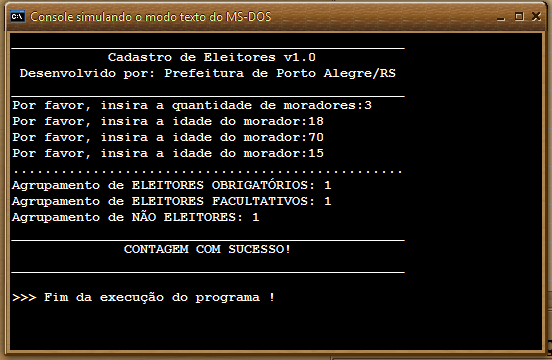

# 📌 Cadastro de Eleitores

## 📋 Descrição

Este projeto consiste em um programa desenvolvido em **VisualG** para cadastrar moradores de uma cidade e classificá-los de acordo com sua elegibilidade para votar com base na idade. A prefeitura deseja obter:

✅ **Quantidade de eleitores obrigatórios** (idade entre 18 e 70 anos).  
✅ **Quantidade de eleitores facultativos** (idade entre 16 e 17 anos ou acima de 70 anos).  
✅ **Quantidade de não eleitores** (menores de 16 anos).  

O programa recebe a idade de um número indeterminado de moradores e calcula os totais para cada categoria.

## 🖥️ Exemplo de Saída

  

## 🚀 Tecnologias Utilizadas

- **VisualG** – Para a implementação do algoritmo.

## 🛠️ Como Executar

1. Abra o **VisualG** no seu computador.
2. Carregue o arquivo `.alg` do projeto.
3. Execute o código e insira as idades conforme solicitado.
4. O programa calculará e exibirá os totais de eleitores obrigatórios, facultativos e não eleitores.

---

📌 **Observação:** Este projeto foi desenvolvido para fins acadêmicos.

